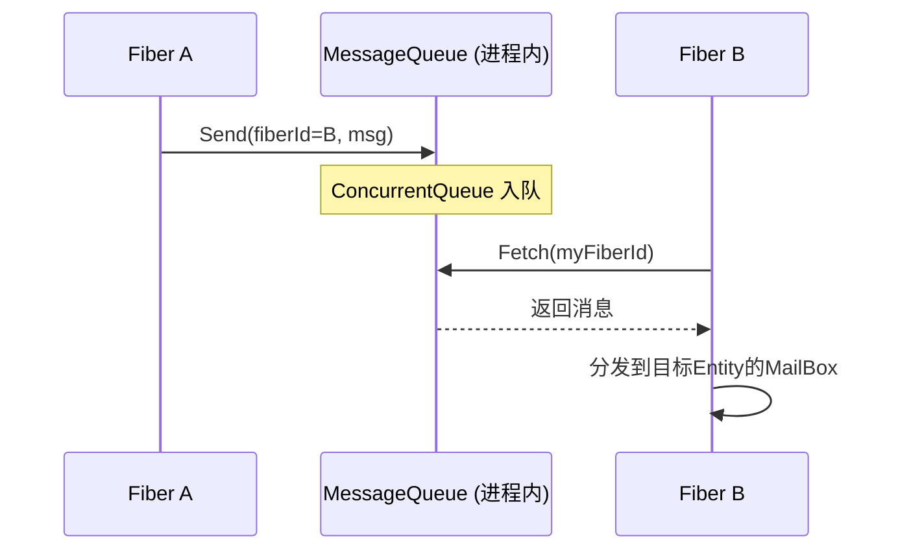

---
tags:
  - ET8/网络框架/Actor模型
---
# Actor 模型

## 什么是 Actor 模型？

Actor 模型是一种并发计算模型，核心思想：

1. **万物皆 Actor**：并发单元就是 Actor
2. **消息驱动**：Actor 之间只通过异步消息通信，不共享内存
3. **串行处理**：每个 Actor 按顺序处理收到的消息
4. **地址透明**：发送者只需知道 Actor 地址，不关心它在哪台机器

> **对前端的类比**：想象每个 GameObject 有一个"邮箱"，你不能直接调用它的方法，只能往邮箱里投信。GameObject 按照收信顺序逐个处理。这就是 Actor 模型。

## ET 中的 Actor

**任何挂载了 `MailBoxComponent` 的 Entity 就是一个 Actor。**

```csharp
// 创建一个 Actor
var unit = scene.AddChild<Unit>();
unit.AddComponent<MailBoxComponent, MailBoxType>(MailBoxType.OrderedMessage);
// 现在 unit 就是一个 Actor，可以接收消息了
```

## ActorId — 三级寻址

```csharp
public struct Address 
{
    public int Process;    // 进程号（哪台机器/哪个进程）
    public int Fiber;      // 纤程号（进程中的哪个 Fiber）
}

public struct ActorId 
{
    public Address Address;     // 定位到 Fiber
    public long InstanceId;     // 定位到 Fiber 中的具体 Entity
}
```

**三级定位**：`Process → Fiber → Entity（InstanceId）`

```
ActorId(Process=1, Fiber=5, InstanceId=123456)
    ↓
在进程1中 → 找到Fiber 5 → 在Fiber 5的Mailboxes中找到InstanceId=123456的Entity
```

## MailBox 处理类型

| MailBoxType | 行为 | 适用场景 |
|---|---|---|
| `OrderedMessage` | 使用**协程锁**保证消息串行处理 | 大多数游戏逻辑（防止并发修改状态） |
| `UnOrderedMessage` | 消息并发处理，不加锁 | 无状态服务（如纯转发） |
| `GateSession` | 直接转发给客户端 Session | Gate 网关的玩家 Session |

## 消息处理流水线

```
消息到达 Fiber
    ↓
ProcessInnerSender.Update() — 从 MessageQueue 拉取
    ↓
查找 Mailboxes[instanceId] — 找到目标 MailBoxComponent
    ↓
MailBoxComponent.Add() — 按 MailBoxType 分发
    ↓
┌─ OrderedMessage: 获取协程锁 → MessageDispatcher.Handle()
├─ UnOrderedMessage: 直接 MessageDispatcher.Handle()  
└─ GateSession: 直接 Session.Send() 转发客户端
    ↓
MessageDispatcher — 按消息 Type + SceneType 查找 Handler
    ↓
IMHandler.Handle() — 具体业务处理器执行
```

## Handler 编写示例

**普通 Actor 消息处理器**（Send 型，无需回复）：

```csharp
[MessageHandler(SceneType.Map)]
public class C2M_MoveHandler : MessageHandler<Unit, C2M_Move>
{
    protected override async ETTask Run(Unit unit, C2M_Move message)
    {
        // 处理移动逻辑
        unit.Position = message.Position;
    }
}
```

**RPC 消息处理器**（Call 型，需要回复）：

```csharp
[MessageHandler(SceneType.Gate)]
public class C2G_LoginGateHandler : MessageHandler<Scene, C2G_LoginGateRequest, C2G_LoginGateResponse>
{
    protected override async ETTask Run(Scene scene, C2G_LoginGateRequest request, C2G_LoginGateResponse response)
    {
        // 验证 Key
        string account = scene.GetComponent<GateSessionKeyComponent>().Get(request.Key);
        if (account == null)
        {
            response.Error = ErrorCode.ERR_ConnectGateKeyError;
            return;
        }
        // 创建玩家
        response.PlayerId = player.Id;
    }
}
```

---

# RPC 通信机制

## 什么是 RPC？

RPC（Remote Procedure Call，远程过程调用）让你像调用本地方法一样调用远程服务的方法：

```csharp
// 看起来像本地调用
G2M_CreateUnitResponse response = await MessageSender.Call(mapActorId, new G2M_CreateUnitRequest());
// 但实际上消息可能发到了另一台机器的另一个进程
```

## 消息类型体系

```
IMessage (消息基类)
├── IRequest  (+RpcId)                    // 需要回复的请求
│   ├── ILocationRequest                  // Location 可迁移消息请求
│   └── ISessionRequest                   // Session 级消息请求
├── IResponse (+Error +Message +RpcId)    // 回复
│   ├── ILocationResponse
│   └── ISessionResponse
├── ILocationMessage                      // Location 单向消息
└── ISessionMessage                       // Session 单向消息
```

## 两种发送模式

| 模式 | 方法 | 特点 |
|---|---|---|
| **Send** | `Send(actorId, message)` | 单向发送，不等待回复（Fire-and-forget） |
| **Call** | `Call(actorId, request)` → `IResponse` | RPC 调用，异步等待回复，40 秒超时 |

## 同进程通信 — ProcessInnerSender

同一个进程内的不同 Fiber 之间通信，使用**内存消息队列**（`MessageQueue`），零网络开销：



**关键实现**：
- `MessageQueue` 是一个 `ConcurrentDictionary<int, ConcurrentQueue<MessageInfo>>`
- 每个 Fiber 有一个队列，发送方直接入队，接收方每帧拉取
- 线程安全且无锁（`ConcurrentQueue`）

## 跨进程通信 — MessageSender + NetInner

当目标 Actor 在其他进程时，消息需要经过**网络传输**：

```
Fiber A (业务层)
    ↓ Call(actorId, request)
    ↓
MessageSender — 判断: actorId.Process ≠ 本进程
    ↓ 包装为 A2NetInner_Request
    ↓ 通过 ProcessInnerSender 发到 NetInner Fiber
    ↓
NetInner Fiber (网络中转站)
    ↓ A2NetInner_RequestHandler 处理
    ↓ ProcessOuterSender.Call()
    ↓
网络层 (KCP/TCP)
    ↓ 序列化 → 包头(ActorId 16字节) + 包体(MemoryPack)
    ↓
远程进程 → ProcessOuterSender.OnRead() → 投递到目标 Fiber → MailBox → Handler
```

**关键设计**：`MessageSender` 作为路由层，自动判断走内存队列还是网络传输，对业务层完全透明。

## Opcode 系统

每个消息类型有唯一的 **Opcode（操作码）**，用于序列化/反序列化时的类型识别：

```csharp
[Message(10001)]  // Opcode = 10001
[ResponseType(nameof(M2C_CreateUnitsResponse))]
public partial class C2M_CreateUnitsRequest : MessageObject, ILocationRequest { }
```

| Opcode 范围 | 用途 |
|---|---|
| 10001 - 20000 | **Outer** — 客户端 ↔ 服务器 |
| 20001 - 40000 | **Inner** — 服务器 ↔ 服务器 |

---

# Actor Location

## 解决什么问题？

前面说过，Actor 的寻址需要 `ActorId`（Process + Fiber + InstanceId）。但在游戏中，**玩家会跨场景迁移**：

```
玩家在 Map1 (Process=1, Fiber=3, InstanceId=12345)
    ↓ 传送到另一个地图
玩家在 Map2 (Process=2, Fiber=7, InstanceId=67890)  ← 整个 ActorId 都变了！
```

问题：其他服务（如 Gate）缓存了旧的 ActorId，消息发到旧地址会找不到人。

## Location Server 的设计

**Location Server** 就像一个"电话簿"，维护 `Entity.Id → ActorId` 的映射：

```
Location Server 注册表:
┌──────────────┬────────────────────────────┐
│ Entity.Id    │ ActorId                     │
│ (永远不变)    │ (随迁移变化)                 │
├──────────────┼────────────────────────────┤
│ 10001        │ Process=1, Fiber=3, Inst=A │
│ 10002        │ Process=2, Fiber=7, Inst=B │
│ 10003        │ Process=1, Fiber=5, Inst=C │
└──────────────┴────────────────────────────┘
```

> **对现实的类比**：`Entity.Id` 相当于你的**身份证号**（永远不变），`ActorId` 相当于你的**住址**（搬家后会变）。Location Server 相当于**户籍系统**，记录每个人当前住在哪里。

## Location 消息发送流程

使用 Location 发送消息时，发送方只需知道 `Entity.Id`，不需要知道 `ActorId`：

```csharp
// 通过 entityId 发消息，不需要知道对方在哪
await MessageLocationSender.Call(locationOneType, entityId, new C2M_MoveRequest());
```

内部流程：
1. 查本地缓存是否有 entityId 的 ActorId
2. 没有 → 向 Location Server 查询
3. 拿到 ActorId → 通过 `MessageSender.Call()` 发送
4. 如果返回 `ERR_NotFoundActor`（对方已迁移） → 等 500ms → 清缓存 → 重新查询 → 重试
5. 最多重试 **20 次**

## 迁移时的 Lock 机制

迁移过程中如何保证消息不丢失？ET 设计了一套**锁机制**：

```
迁移前:
  MapA → LocationServer.Lock(entityId, oldActorId)
  // Location Server 对该 entityId 加协程锁
  // 此后所有 Get(entityId) 的请求都会排队等待

迁移中:
  MapA → MapB: 传输 Entity 数据
  MapB: 创建新 Entity，注册 MailBox

迁移后:
  MapB → LocationServer.UnLock(entityId, oldActorId, newActorId)
  // 更新映射，释放锁
  // 排队的 Get 请求全部返回新的 ActorId
```

这个设计保证了：
- **迁移期间的消息不会丢失**（发送方重试后能找到新地址）
- **不会收到重复消息**（协程锁保证串行）
- **迁移对发送方透明**（自动重试，业务层无感知）

## Location Handler 的特殊设计

**ILocationMessage（Send 型）**的 Handler 收到消息后**立即回复空 MessageResponse**，然后才处理逻辑：

```csharp
// MessageLocationHandler 内部
public async ETTask Handle(Entity entity, Address fromAddress, MessageObject message)
{
    // 立即回复确认（让发送端知道消息已送达）
    ProcessInnerSender.Reply(fromAddress, new MessageResponse());
    // 然后处理业务逻辑
    await this.Run(entity, message);
}
```

为什么？因为 Location 消息有重试机制。如果等处理完再回复，处理时间过长可能触发发送方重试，导致消息重复处理。

---
