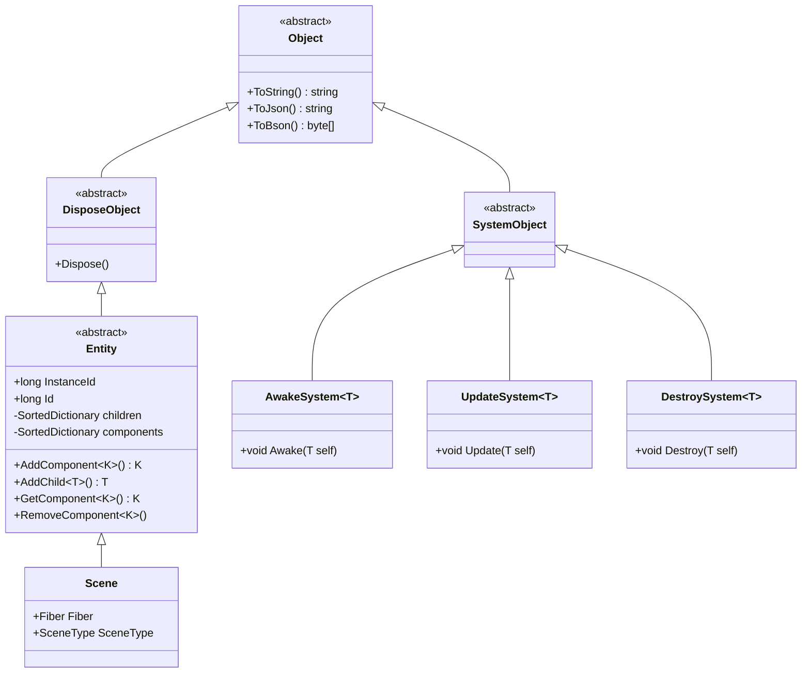
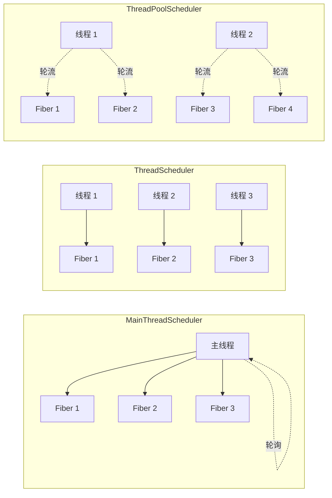
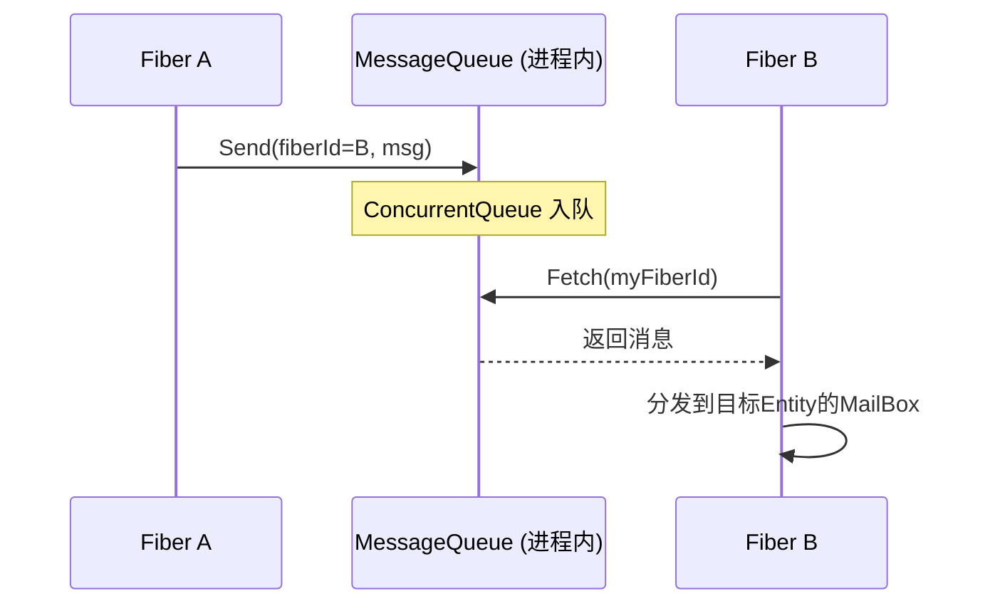

---
tags:
  - ET8/框架介绍/服务器架构
  - ET8
---

# 目录

- [一、游戏服务器概述 — 为什么需要这些设计](#一游戏服务器概述)
- [二、ET 服务端整体架构总览](#二et-服务端整体架构总览)
- [三、ECS 实体组件系统 — 一切皆 Entity](#三ecs-实体组件系统)
- [四、Fiber 纤程模型 — 轻量级虚拟进程](#四fiber-纤程模型)
- [五、Actor 模型 — 消息驱动的并发](#五actor-模型)
- [六、RPC 通信机制 — 同进程与跨进程](#六rpc-通信机制)
- [七、Actor Location — 可迁移 Actor 的寻址](#七actor-location)
- [八、网络传输层 — KCP/TCP/WebSocket](#八网络传输层)
- [九、协程锁与定时器 — 异步编程基础设施](#九协程锁与定时器)
- [十、服务端启动流程详解](#十服务端启动流程详解)
- [十一、游戏服务器通用知识科普](#十一游戏服务器通用知识科普)
- [附录：关键源码文件索引](#附录关键源码文件索引)

---

# 一、游戏服务器概述

## 1.1 对前端程序员的类比

如果你熟悉 Unity 前端开发，可以用以下类比来理解游戏服务器：

| Unity 前端概念 | 游戏服务器对应概念 |
|---|---|
| MonoBehaviour 的 `Update()` 循环 | 服务器的主循环（每帧处理消息、更新逻辑） |
| 场景（Scene） | 服务器的逻辑分区（如一个地图实例） |
| `GameObject` + `Component` | 服务端的 Entity + Component（ET 的 ECS） |
| `SendMessage()` / 事件系统 | Actor 消息 / RPC 调用 |
| Unity 的单线程模型 | ET 的 Fiber 模型（多个"单线程"并行） |
| Prefab 实例化 | 服务器创建玩家实体、NPC 实体 |

## 1.2 游戏服务器面临的核心挑战

1. **高并发**：成千上万玩家同时在线，每秒数万条消息
2. **低延迟**：玩家操作需要快速响应（<100ms）
3. **状态一致性**：多个玩家看到的游戏世界必须一致
4. **可扩展性**：单机承载有限，需要分布式部署
5. **热更新**：不停服更新游戏逻辑
6. **容错性**：单点故障不能导致整个服务崩溃

ET 框架的每一个核心设计点，都是为了解决上述一个或多个问题。

---

# 二、ET 服务端整体架构总览

## 2.1 架构全景图

```
┌──────────────────────────────────────────────────────────────┐
│                     World (进程级全局管理)                      │
│   FiberManager / OpcodeType / NetServices / CodeTypes ...     │
├──────────────────────────────────────────────────────────────┤
│ ┌──────────┐ ┌──────────┐ ┌──────────┐ ┌──────────┐        │
│ │Main Fiber│ │NetInner  │ │ Realm    │ │  Gate    │ ...     │
│ │  (入口)   │ │Fiber     │ │ Fiber    │ │  Fiber   │        │
│ │          │ │(内网通信) │ │(登录验证) │ │ (网关)    │        │
│ └──────────┘ └──────────┘ └──────────┘ └──────────┘        │
│ ┌──────────┐ ┌──────────┐ ┌──────────┐                     │
│ │Location  │ │   Map    │ │  Match   │ ...                  │
│ │Fiber     │ │  Fiber   │ │  Fiber   │                     │
│ │(位置服务) │ │ (地图)    │ │ (匹配)   │                     │
│ └──────────┘ └──────────┘ └──────────┘                     │
│                                                              │
│           MessageQueue (Fiber间消息队列)                       │
├──────────────────────────────────────────────────────────────┤
│                  Network Layer                                │
│     KService(KCP/UDP)  TService(TCP)  WService(WebSocket)    │
└──────────────────────────────────────────────────────────────┘
      ↑↓ 客户端连接              ↑↓ 进程间连接
```

## 2.2 分层说明

| 层次 | 职责 | 关键类 |
|------|------|--------|
| **World 层** | 进程级全局单例管理 | `World`, `Singleton<T>`, `FiberManager` |
| **Fiber 层** | 独立执行上下文，每个 Fiber 有自己的 Update 循环 | `Fiber`, `EntitySystem`, `Mailboxes` |
| **Entity 层** | 业务数据和逻辑的载体（ECS 模式） | `Entity`, `Scene`, `Component` |
| **Actor 层** | 基于 MailBox 的消息驱动模型 | `MailBoxComponent`, `MessageDispatcher`, `IMHandler` |
| **通信层** | 进程内/跨进程消息路由 | `ProcessInnerSender`, `MessageSender`, `ProcessOuterSender` |
| **网络层** | 底层传输协议 | `KService`, `TService`, `WService`, `AChannel` |

## 2.3 关键设计哲学

> **"单线程多进程"** — 每个 Fiber 内部是单线程的（避免锁），多个 Fiber 并行执行（提升吞吐）。这是 ET 最核心的设计思想，贯穿所有子系统。

---

# 三、ECS 实体组件系统

## 3.1 什么是 ECS？

ECS（Entity-Component-System）是一种架构模式，将 **数据** 和 **行为** 完全分离：

- **Entity**：只是一个 ID，是组件的容器
- **Component**：纯数据，不含逻辑方法
- **System**：纯逻辑，操作特定类型的 Component

> **对比 Unity 的 MonoBehaviour**：Unity 的 `MonoBehaviour` 既有数据（字段）又有逻辑（`Update`、`OnCollision` 等），是"面向对象"的设计。ET 的 ECS 将它们拆开，组件只存数据，System 只写逻辑。

## 3.2 ET 的 ECS 核心类图



## 3.3 Entity 的关键特征

ET 中的 Entity 有两个重要 ID：

| ID | 含义 | 生命周期 | 用途 |
|---|---|---|---|
| `Id` | 持久化标识 | 数据库级，跨进程不变 | MongoDB `_id`，唯一标识一个逻辑实体 |
| `InstanceId` | 运行时实例标识 | 进程内唯一，重启后改变 | Actor 消息寻址，标识内存中的具体对象 |

**Entity 既是实体也是组件** — ET 的 Component 本身也继承 Entity，这意味着组件也可以有自己的子组件。这种递归设计让数据结构非常灵活：

```
Scene (根实体)
├── PlayerComponent (组件)
│   └── Player (子实体)
│       ├── UnitComponent (组件)
│       ├── BagComponent (组件)
│       └── ...
├── TimerComponent (组件)
├── CoroutineLockComponent (组件)
└── ...
```

## 3.4 System 的双重标记模式

ET 使用**双重标记**来关联 Entity 和 System：

**第一步**：Entity 类实现标记接口（声明"我需要哪些生命周期"）

```csharp
// 声明 PlayerComponent 需要 Awake(带参数) 和 Destroy 回调
[ComponentOf(typeof(Scene))]
public class PlayerComponent : Entity, IAwake, IDestroy
{
    public Dictionary<long, EntityRef<Player>> idPlayers;
}
```

**第二步**：对应的 System 类实现具体逻辑

```csharp
[EntitySystem]
public class PlayerComponentAwakeSystem : AwakeSystem<PlayerComponent>
{
    protected override void Awake(PlayerComponent self)
    {
        self.idPlayers = new Dictionary<long, EntityRef<Player>>();
    }
}

[EntitySystem]
public class PlayerComponentDestroySystem : DestroySystem<PlayerComponent>
{
    protected override void Destroy(PlayerComponent self)
    {
        // 清理逻辑
    }
}
```

**完整的 System 接口族：**

| System 类型 | 标记接口 | 触发时机 | 更新队列 |
|---|---|---|---|
| `AwakeSystem<T>` | `IAwake` / `IAwake<A>` / `IAwake<A,B>` / `IAwake<A,B,C>` | `AddComponent` 时 | 无 |
| `DestroySystem<T>` | `IDestroy` | `Dispose` 时 | 无 |
| `UpdateSystem<T>` | `IUpdate` | 每帧 | Update(0) |
| `LateUpdateSystem<T>` | `ILateUpdate` | 每帧（Update 之后） | LateUpdate(1) |
| `SerializeSystem<T>` | `ISerialize` | 序列化前 | 无 |
| `DeserializeSystem<T>` | `IDeserialize` | 反序列化后 | 无 |

> **为什么这样设计？** 数据和逻辑分离后，Hotfix.dll（包含 System）可以热重载，而 Model.dll（包含 Entity/Component 数据定义）保持不变。这就实现了**不停服热更新游戏逻辑**。

## 3.5 对象池机制

ET 的所有 Entity 和 MessageObject 都支持对象池：

```csharp
[DisableNew]  // 禁止 new，强制使用对象池
public abstract class MessageObject : ProtoObject, IMessage, IDisposable, IPool
{
    public bool IsFromPool { get; set; }
}
```

`Entity.Create<T>(scene, isFromPool)` 从池中获取，`Dispose()` 时自动回收。这大幅减少了 GC 压力，对于高频创建销毁的场景（如网络消息）尤为重要。

---

# 四、Fiber 纤程模型

## 4.1 什么是 Fiber？

**Fiber（纤程）** 是 ET 框架中最核心的并发模型。你可以把它理解为一个**轻量级的虚拟进程**：

| 操作系统进程 | ET Fiber |
|---|---|
| 有独立的内存空间 | 有独立的 Entity 树（Root Scene） |
| 有独立的线程/调度 | 有独立的 Update/LateUpdate 循环 |
| 通过 IPC/网络通信 | 通过 MessageQueue 通信 |
| 重量级，创建成本高 | 轻量级，内存中的一个对象 |

> **对前端的类比**：想象 Unity 的每个 Scene 可以独立运行 Update，互相之间只能通过消息通信 — 这就是 Fiber。

## 4.2 Fiber 的核心结构

```csharp
public class Fiber : IDisposable
{
    [ThreadStatic] internal static Fiber Instance;  // 当前线程正在执行的 Fiber
    
    public int Id;                    // 纤程 ID
    public int Zone;                  // 所属区服
    public Scene Root;                // 根场景实体（实体树的根）
    public EntitySystem EntitySystem; // Update/LateUpdate 队列
    public Mailboxes Mailboxes;       // Actor 邮箱注册表
    public ThreadSynchronizationContext SynchronizationContext; // 异步回调调度
}
```

**`[ThreadStatic]` 的作用**：`Fiber.Instance` 是线程静态变量，保证在任意时刻，一个线程只会执行一个 Fiber 的逻辑。这从根本上避免了多线程并发问题 — 因为 Fiber 内部代码永远是单线程环境。

## 4.3 三种调度模式



| 调度器 | 机制 | 适用场景 |
|---|---|---|
| `MainThreadScheduler` | 所有 Fiber 在主线程轮询 | Unity Editor 调试（需要主线程访问 Unity API） |
| `ThreadScheduler` | 每个 Fiber 一个独立线程 | 开发调试（方便断点） |
| `ThreadPoolScheduler` | N 个线程共享调度所有 Fiber | **生产环境**（N = CPU 核心数，最高效） |

## 4.4 SceneType — Fiber 的角色定义

每个 Fiber 创建时指定 `SceneType`，决定它的功能角色：

| SceneType | 角色 | 核心组件 |
|---|---|---|
| `Main` | 进程入口，初始化其他 Fiber | Timer, CoroutineLock, MailBox |
| `NetInner` | 进程间网络通信中转 | ProcessOuterSender, ProcessInnerSender |
| `Realm` | 登录/注册验证 | NetComponent(监听客户端), MessageSender |
| `Gate` | 客户端网关，消息路由 | NetComponent, PlayerComponent, LocationProxy |
| `Location` | Actor 位置注册服务 | LocationManagerComponent |
| `Map` | 游戏地图/场景逻辑 | UnitComponent, AOIManager, LocationProxy |
| `Match` | 匹配系统 | MatchComponent |
| `Router` | 网络路由/NAT 穿透 | RouterComponent |

> **游戏服务知识**：传统游戏服务器按"服务类型"部署多个进程（Login Server、Gate Server、Game Server...）。ET 用 Fiber 替代进程，一个物理进程可以包含多种类型的 Fiber，也可以拆分到不同机器 — 实现了**灵活的分布式部署**。

## 4.5 单进程 vs 分布式

ET 的一大优势是**开发时单进程，部署时分布式**：

```
开发模式（Localhost）:
┌──────── 单个进程 ────────┐
│ Main / NetInner / Realm  │
│ Gate / Location / Map    │  ← 所有 Fiber 在一个进程中
│ Match / Router ...       │
└──────────────────────────┘

生产模式（Release）:
┌── 进程1 ──┐  ┌── 进程2 ──┐  ┌── 进程3 ──┐
│ Main      │  │ Gate ×3   │  │ Map ×5    │
│ NetInner  │  │ NetInner  │  │ NetInner  │
│ Realm     │  │           │  │           │
│ Location  │  │           │  │           │
└───────────┘  └───────────┘  └───────────┘
               ↑↓ KCP/TCP 通信 ↑↓
```

通过修改 `StartSceneConfig` 配置，将不同的 SceneType 分配到不同 Process，即可实现从单机到分布式的平滑过渡。

---

# 五、Actor 模型

## 5.1 什么是 Actor 模型？

Actor 模型是一种并发计算模型，核心思想：

1. **万物皆 Actor**：并发单元就是 Actor
2. **消息驱动**：Actor 之间只通过异步消息通信，不共享内存
3. **串行处理**：每个 Actor 按顺序处理收到的消息
4. **地址透明**：发送者只需知道 Actor 地址，不关心它在哪台机器

> **对前端的类比**：想象每个 GameObject 有一个"邮箱"，你不能直接调用它的方法，只能往邮箱里投信。GameObject 按照收信顺序逐个处理。这就是 Actor 模型。

## 5.2 ET 中的 Actor

**任何挂载了 `MailBoxComponent` 的 Entity 就是一个 Actor。**

```csharp
// 创建一个 Actor
var unit = scene.AddChild<Unit>();
unit.AddComponent<MailBoxComponent, MailBoxType>(MailBoxType.OrderedMessage);
// 现在 unit 就是一个 Actor，可以接收消息了
```

## 5.3 ActorId — 三级寻址

```csharp
public struct Address 
{
    public int Process;    // 进程号（哪台机器/哪个进程）
    public int Fiber;      // 纤程号（进程中的哪个 Fiber）
}

public struct ActorId 
{
    public Address Address;     // 定位到 Fiber
    public long InstanceId;     // 定位到 Fiber 中的具体 Entity
}
```

**三级定位**：`Process → Fiber → Entity（InstanceId）`

```
ActorId(Process=1, Fiber=5, InstanceId=123456)
    ↓
在进程1中 → 找到Fiber 5 → 在Fiber 5的Mailboxes中找到InstanceId=123456的Entity
```

## 5.4 MailBox 处理类型

| MailBoxType | 行为 | 适用场景 |
|---|---|---|
| `OrderedMessage` | 使用**协程锁**保证消息串行处理 | 大多数游戏逻辑（防止并发修改状态） |
| `UnOrderedMessage` | 消息并发处理，不加锁 | 无状态服务（如纯转发） |
| `GateSession` | 直接转发给客户端 Session | Gate 网关的玩家 Session |

## 5.5 消息处理流水线

```
消息到达 Fiber
    ↓
ProcessInnerSender.Update() — 从 MessageQueue 拉取
    ↓
查找 Mailboxes[instanceId] — 找到目标 MailBoxComponent
    ↓
MailBoxComponent.Add() — 按 MailBoxType 分发
    ↓
┌─ OrderedMessage: 获取协程锁 → MessageDispatcher.Handle()
├─ UnOrderedMessage: 直接 MessageDispatcher.Handle()  
└─ GateSession: 直接 Session.Send() 转发客户端
    ↓
MessageDispatcher — 按消息 Type + SceneType 查找 Handler
    ↓
IMHandler.Handle() — 具体业务处理器执行
```

## 5.6 Handler 编写示例

**普通 Actor 消息处理器**（Send 型，无需回复）：

```csharp
[MessageHandler(SceneType.Map)]
public class C2M_MoveHandler : MessageHandler<Unit, C2M_Move>
{
    protected override async ETTask Run(Unit unit, C2M_Move message)
    {
        // 处理移动逻辑
        unit.Position = message.Position;
    }
}
```

**RPC 消息处理器**（Call 型，需要回复）：

```csharp
[MessageHandler(SceneType.Gate)]
public class C2G_LoginGateHandler : MessageHandler<Scene, C2G_LoginGateRequest, C2G_LoginGateResponse>
{
    protected override async ETTask Run(Scene scene, C2G_LoginGateRequest request, C2G_LoginGateResponse response)
    {
        // 验证 Key
        string account = scene.GetComponent<GateSessionKeyComponent>().Get(request.Key);
        if (account == null)
        {
            response.Error = ErrorCode.ERR_ConnectGateKeyError;
            return;
        }
        // 创建玩家
        response.PlayerId = player.Id;
    }
}
```

---

# 六、RPC 通信机制

## 6.1 什么是 RPC？

RPC（Remote Procedure Call，远程过程调用）让你像调用本地方法一样调用远程服务的方法：

```csharp
// 看起来像本地调用
G2M_CreateUnitResponse response = await MessageSender.Call(mapActorId, new G2M_CreateUnitRequest());
// 但实际上消息可能发到了另一台机器的另一个进程
```

## 6.2 消息类型体系

```
IMessage (消息基类)
├── IRequest  (+RpcId)                    // 需要回复的请求
│   ├── ILocationRequest                  // Location 可迁移消息请求
│   └── ISessionRequest                   // Session 级消息请求
├── IResponse (+Error +Message +RpcId)    // 回复
│   ├── ILocationResponse
│   └── ISessionResponse
├── ILocationMessage                      // Location 单向消息
└── ISessionMessage                       // Session 单向消息
```

## 6.3 两种发送模式

| 模式 | 方法 | 特点 |
|---|---|---|
| **Send** | `Send(actorId, message)` | 单向发送，不等待回复（Fire-and-forget） |
| **Call** | `Call(actorId, request)` → `IResponse` | RPC 调用，异步等待回复，40 秒超时 |

## 6.4 同进程通信 — ProcessInnerSender

同一个进程内的不同 Fiber 之间通信，使用**内存消息队列**（`MessageQueue`），零网络开销：



**关键实现**：
- `MessageQueue` 是一个 `ConcurrentDictionary<int, ConcurrentQueue<MessageInfo>>`
- 每个 Fiber 有一个队列，发送方直接入队，接收方每帧拉取
- 线程安全且无锁（`ConcurrentQueue`）

## 6.5 跨进程通信 — MessageSender + NetInner

当目标 Actor 在其他进程时，消息需要经过**网络传输**：

```
Fiber A (业务层)
    ↓ Call(actorId, request)
    ↓
MessageSender — 判断: actorId.Process ≠ 本进程
    ↓ 包装为 A2NetInner_Request
    ↓ 通过 ProcessInnerSender 发到 NetInner Fiber
    ↓
NetInner Fiber (网络中转站)
    ↓ A2NetInner_RequestHandler 处理
    ↓ ProcessOuterSender.Call()
    ↓
网络层 (KCP/TCP)
    ↓ 序列化 → 包头(ActorId 16字节) + 包体(MemoryPack)
    ↓
远程进程 → ProcessOuterSender.OnRead() → 投递到目标 Fiber → MailBox → Handler
```

**关键设计**：`MessageSender` 作为路由层，自动判断走内存队列还是网络传输，对业务层完全透明。

## 6.6 Opcode 系统

每个消息类型有唯一的 **Opcode（操作码）**，用于序列化/反序列化时的类型识别：

```csharp
[Message(10001)]  // Opcode = 10001
[ResponseType(nameof(M2C_CreateUnitsResponse))]
public partial class C2M_CreateUnitsRequest : MessageObject, ILocationRequest { }
```

| Opcode 范围 | 用途 |
|---|---|
| 10001 - 20000 | **Outer** — 客户端 ↔ 服务器 |
| 20001 - 40000 | **Inner** — 服务器 ↔ 服务器 |

---

# 七、Actor Location

## 7.1 解决什么问题？

前面说过，Actor 的寻址需要 `ActorId`（Process + Fiber + InstanceId）。但在游戏中，**玩家会跨场景迁移**：

```
玩家在 Map1 (Process=1, Fiber=3, InstanceId=12345)
    ↓ 传送到另一个地图
玩家在 Map2 (Process=2, Fiber=7, InstanceId=67890)  ← 整个 ActorId 都变了！
```

问题：其他服务（如 Gate）缓存了旧的 ActorId，消息发到旧地址会找不到人。

## 7.2 Location Server 的设计

**Location Server** 就像一个"电话簿"，维护 `Entity.Id → ActorId` 的映射：

```
Location Server 注册表:
┌──────────────┬────────────────────────────┐
│ Entity.Id    │ ActorId                     │
│ (永远不变)    │ (随迁移变化)                 │
├──────────────┼────────────────────────────┤
│ 10001        │ Process=1, Fiber=3, Inst=A │
│ 10002        │ Process=2, Fiber=7, Inst=B │
│ 10003        │ Process=1, Fiber=5, Inst=C │
└──────────────┴────────────────────────────┘
```

> **对现实的类比**：`Entity.Id` 相当于你的**身份证号**（永远不变），`ActorId` 相当于你的**住址**（搬家后会变）。Location Server 相当于**户籍系统**，记录每个人当前住在哪里。

## 7.3 Location 消息发送流程

使用 Location 发送消息时，发送方只需知道 `Entity.Id`，不需要知道 `ActorId`：

```csharp
// 通过 entityId 发消息，不需要知道对方在哪
await MessageLocationSender.Call(locationOneType, entityId, new C2M_MoveRequest());
```

内部流程：
1. 查本地缓存是否有 entityId 的 ActorId
2. 没有 → 向 Location Server 查询
3. 拿到 ActorId → 通过 `MessageSender.Call()` 发送
4. 如果返回 `ERR_NotFoundActor`（对方已迁移） → 等 500ms → 清缓存 → 重新查询 → 重试
5. 最多重试 **20 次**

## 7.4 迁移时的 Lock 机制

迁移过程中如何保证消息不丢失？ET 设计了一套**锁机制**：

```
迁移前:
  MapA → LocationServer.Lock(entityId, oldActorId)
  // Location Server 对该 entityId 加协程锁
  // 此后所有 Get(entityId) 的请求都会排队等待

迁移中:
  MapA → MapB: 传输 Entity 数据
  MapB: 创建新 Entity，注册 MailBox

迁移后:
  MapB → LocationServer.UnLock(entityId, oldActorId, newActorId)
  // 更新映射，释放锁
  // 排队的 Get 请求全部返回新的 ActorId
```

这个设计保证了：
- **迁移期间的消息不会丢失**（发送方重试后能找到新地址）
- **不会收到重复消息**（协程锁保证串行）
- **迁移对发送方透明**（自动重试，业务层无感知）

## 7.5 Location Handler 的特殊设计

**ILocationMessage（Send 型）**的 Handler 收到消息后**立即回复空 MessageResponse**，然后才处理逻辑：

```csharp
// MessageLocationHandler 内部
public async ETTask Handle(Entity entity, Address fromAddress, MessageObject message)
{
    // 立即回复确认（让发送端知道消息已送达）
    ProcessInnerSender.Reply(fromAddress, new MessageResponse());
    // 然后处理业务逻辑
    await this.Run(entity, message);
}
```

为什么？因为 Location 消息有重试机制。如果等处理完再回复，处理时间过长可能触发发送方重试，导致消息重复处理。

---

# 八、网络传输层

## 8.1 三种传输协议

| 协议 | 类 | 特点 | 用途 |
|---|---|---|---|
| **KCP/UDP** | `KService` + `KChannel` | 可靠 UDP，低延迟 | 客户端 ↔ 服务器（游戏数据） |
| **TCP** | `TService` + `TChannel` | 稳定可靠，有序 | 服务器 ↔ 服务器（内网通信） |
| **WebSocket** | `WService` + `WChannel` | 浏览器兼容 | WebGL 客户端 |

## 8.2 KCP 协议简介

KCP 是一个基于 UDP 的可靠传输协议。为什么不直接用 TCP？

| | TCP | KCP/UDP |
|---|---|---|
| 延迟 | 较高（Nagle 算法、拥塞控制保守） | 更低（可配置激进重传） |
| 头部开销 | 20+ 字节 | 自定义，更精简 |
| NAT 穿透 | 困难 | 相对容易 |
| 丢包处理 | 重传整个窗口 | 选择性重传 |

对于游戏来说，**低延迟**比带宽效率更重要，因此 KCP 是更好的选择。

## 8.3 消息包格式

**Outer 消息**（客户端 ↔ 服务器）：
```
[2字节 Opcode] [消息体 MemoryPack序列化]
```

**Inner 消息**（服务器 ↔ 服务器）：
```
[2字节 Opcode] [16字节 ActorId] [消息体 MemoryPack序列化]
```

Inner 消息额外包含 `ActorId`（8字节 Address + 8字节 InstanceId），用于在目标进程中精确路由到目标 Entity。

## 8.4 KService 的连接管理

KService 实现了自定义的**四阶段握手**协议：

```
客户端                  服务器
  |--- SYN(localConn) -->|       // 1. 客户端发起连接
  |<-- ACK(localConn,   |       // 2. 服务器分配远程连接ID
  |    remoteConn) ------|
  |--- MSG(data) ------->|       // 3. 开始正常通信
  |--- FIN ------------->|       // 4. 断开连接
```

## 8.5 大消息分片

KCP 消息有大小限制（`MaxKcpMessageSize = 10000` 字节）。超过此大小的消息会自动**分片/重组**：

```
大消息 (30000 bytes)
    ↓ 分片
[Fragment 1: 10000B] [Fragment 2: 10000B] [Fragment 3: 10000B]
    ↓ 逐个发送
    ↓ 接收端重组
原始消息 (30000 bytes)
```

---

# 九、协程锁与定时器

## 9.1 协程锁（CoroutineLock）

> **对前端的类比**：Unity 的协程（Coroutine）是无法"加锁"的。如果两个协程同时修改同一数据，会产生竞争条件。ET 的协程锁就是为单线程异步环境设计的"锁"。

**问题场景**：

```csharp
// 两个消息同时到达，都要修改玩家数据
async ETTask Handler1(Player player) {
    var data = await DB.Query(player.Id);  // 从DB读取
    data.Gold += 100;
    await DB.Save(data);                    // 保存到DB
}

async ETTask Handler2(Player player) {
    var data = await DB.Query(player.Id);  // 这里读到的可能是 Handler1 还没保存的旧数据！
    data.Gold -= 50;
    await DB.Save(data);                    // 覆盖了 Handler1 的修改！
}
```

虽然是单线程，但 `await` 会让出执行权，导致交错执行。

**协程锁解决方案**：

```csharp
async ETTask Handler1(Player player) {
    using (await CoroutineLockComponent.Wait(CoroutineLockType.DB, player.Id)) {
        var data = await DB.Query(player.Id);
        data.Gold += 100;
        await DB.Save(data);
    } // using 结束自动释放锁
}

async ETTask Handler2(Player player) {
    using (await CoroutineLockComponent.Wait(CoroutineLockType.DB, player.Id)) {
        // Handler1 持有锁时,这里会 await 挂起
        // Handler1 释放锁后,才会继续执行
        var data = await DB.Query(player.Id);
        data.Gold -= 50;
        await DB.Save(data);
    }
}
```

**内部实现**：
- 每个 `(lockType, key)` 对应一个 `CoroutineLockQueue`
- 队列空闲时直接获得锁
- 队列占用时创建 `WaitCoroutineLock` 入队等待
- 当前锁 `Dispose` 时，从队列唤醒下一个等待者
- 支持**超时机制**，防止死锁

**常见 CoroutineLockType**：

| 类型 | 用途 |
|---|---|
| `Mailbox` | MailBoxComponent 的 OrderedMessage 串行处理 |
| `MessageLocationSender` | 同一 entityId 的 Location 消息串行发送 |
| `Location` | Location Server 的增删改查串行执行 |
| `DB` | 同一 Entity 的数据库操作串行执行 |

## 9.2 定时器（TimerComponent）

**三种定时器**：

| 类型 | API | 说明 |
|---|---|---|
| **一次性回调** | `NewOnceTimer(time, type, args)` | 到点触发一次 |
| **一次性 await** | `WaitAsync(ms)` / `WaitTillAsync(time)` | 异步等待，类似 `Task.Delay` |
| **重复定时器** | `NewRepeatedTimer(interval, type, args)` | 周期性触发 |

```csharp
// 等待 3 秒
await TimerComponent.WaitAsync(3000);

// 5 秒后执行一次回调
TimerComponent.NewOnceTimer(TimeInfo.Instance.ServerNow() + 5000, TimerInvokeType.MyCallback, args);

// 每 1 秒执行一次
long timerId = TimerComponent.NewRepeatedTimer(1000, TimerInvokeType.HeartBeat, args);
```

**内部实现**：基于 `MultiMap<long, long>`（触发时间 → timerId 列表），每帧检查 `minTime`，到点触发。

---

# 十、服务端启动流程详解

## 10.1 启动链路

```
Program.Main()
  │
  ├─ 1. Init.Start()
  │     ├─ 解析命令行参数 → Options 单例
  │     │   (AppType, Process, StartConfig, LogLevel...)
  │     ├─ 初始化核心单例
  │     │   Logger / TimeInfo / FiberManager
  │     └─ CodeLoader.Awake()
  │         ├─ 加载 Model.dll (数据定义)
  │         ├─ 加载 Hotfix.dll (逻辑代码,支持热重载)
  │         └─ Entry.Start() → 创建 Main Fiber
  │
  ├─ 2. FiberInit_Main → 分发初始化事件
  │     ├─ EntryEvent1: 共享初始化
  │     │   Timer / CoroutineLock / MailBox / ProcessInnerSender
  │     │
  │     ├─ EntryEvent2: 服务端初始化 (AppType=Server时)
  │     │   ├─ 创建 NetInner Fiber (进程间通信)
  │     │   └─ 遍历 StartSceneConfig 创建所有场景 Fiber:
  │     │       ├─ Realm Fiber → FiberInit_Realm
  │     │       ├─ Gate Fiber  → FiberInit_Gate
  │     │       ├─ Location Fiber → FiberInit_Location
  │     │       ├─ Map Fiber → FiberInit_Map
  │     │       └─ ...
  │     │
  │     └─ EntryEvent3: (客户端初始化,服务端无操作)
  │
  └─ 3. 主循环 (1ms 间隔)
        while(true) {
            Init.Update()     → World 更新所有单例
            Init.LateUpdate() → World 延迟更新
            Thread.Sleep(1)
        }
```

## 10.2 配置驱动

服务器的部署拓扑完全由配置决定：

**StartSceneConfig** 示例：
```
| Id    | Process | Zone | SceneType | Name     | Port  |
|-------|---------|------|-----------|----------|-------|
| 10001 | 1       | 1    | Realm     | Realm1   | 20001 |
| 10002 | 1       | 1    | Gate      | Gate1    | 20002 |
| 10003 | 1       | 1    | Gate      | Gate2    | 20003 |
| 10004 | 1       | 0    | Location  | Location | 0     |
| 10005 | 1       | 1    | Map       | Map1     | 0     |
```

- `Process=1` 表示这些 Fiber 都在进程 1 中（单进程开发模式）
- 改为 `Process=2` 即可将该 Fiber 拆到另一个进程
- `Port` 非零表示该 Fiber 监听外网端口（如 Gate 接收客户端连接）

---

# 十一、游戏服务器通用知识科普

## 11.1 游戏服务器的常见架构模式

### 模式一：单体架构（Monolithic）

```
┌─── 单个服务器进程 ───┐
│ 所有逻辑在一起        │ ← 简单但扩展性差
│ 登录 + 游戏 + 匹配    │
└──────────────────────┘
```

**优点**：简单、延迟低（无网络开销）
**缺点**：无法水平扩展、单点故障

### 模式二：微服务架构（Microservices）

```
┌─────┐ ┌─────┐ ┌─────┐ ┌─────┐
│Login│ │Gate │ │Game │ │Chat │ ← 各司其职
└──┬──┘ └──┬──┘ └──┬──┘ └──┬──┘
   └───────┴───────┴───────┘
          消息总线/RPC
```

**优点**：可独立扩展、隔离故障
**缺点**：复杂度高、网络延迟

### ET 的模式：融合架构

ET 通过 Fiber 实现了两种模式的融合：
- **开发时**像单体架构（所有 Fiber 在一个进程，调试方便）
- **部署时**像微服务架构（Fiber 可分布到不同进程/机器）

## 11.2 网关（Gate）的作用

```
客户端1 ─┐                 ┌─ Map1 (地图服)
客户端2 ─┼─ Gate (网关) ──┼─ Map2
客户端3 ─┘    │            └─ Map3
              │
              ├─ 连接管理（维护客户端Session）
              ├─ 消息路由（转发到正确的目标服务）
              ├─ 协议转换（Outer消息 → Inner消息）
              └─ 负载均衡（选择合适的Map服务）
```

Gate 网关的核心职责：
1. **维护客户端连接**：一个客户端对应一个 Session
2. **消息路由**：根据消息类型转发到对应的后端服务
3. **安全屏障**：客户端只能连接 Gate，不能直接访问内部服务
4. **GateSession MailBox**：收到发给玩家的消息后，直接通过 Session 转发给客户端

## 11.3 登录流程示例

```
客户端                  Realm              Gate               Map
  |                      |                  |                  |
  |--- C2R_Login ------->|                  |                  |
  |                      |-- 验证账号 ------>|                  |
  |<-- R2C_Login --------|                  |                  |
  |    (GateAddr, Key)   |                  |                  |
  |                      |                  |                  |
  |--- C2G_LoginGate ----|----------------->|                  |
  |    (Key)             |                  |-- 验证Key          |
  |                      |                  |-- 创建Player      |
  |<-- G2C_LoginGate ----|------------------|                  |
  |    (PlayerId)        |                  |                  |
  |                      |                  |                  |
  |--- C2G_EnterMap -----|----------------->|                  |
  |                      |                  |--- G2M_Create -->|
  |                      |                  |    (PlayerInfo)  |
  |                      |                  |<-- M2G_Create ---|
  |<-- G2C_EnterMap -----|------------------|    (UnitInfo)    |
  |    (MapInfo)         |                  |                  |
```

1. 客户端先连接 Realm 验证账号
2. Realm 返回网关地址和临时密钥
3. 客户端用密钥连接 Gate
4. Gate 创建 Player 并通知 Map 创建游戏实体

## 11.4 AOI（Area of Interest）

AOI 是游戏服务器中非常重要的优化技术：

```
200x200 的大地图上有 10000 个玩家
如果每个玩家都向所有人同步位置 → 10000 × 10000 = 1亿次/帧 ← 不可能！

AOI 解决方案：
┌────────┬────────┬────────┐
│ 区域1   │ 区域2   │ 区域3   │
│ 玩家A,B │ 玩家C   │ 玩家D   │
├────────┼────────┼────────┤
│ 区域4   │ 区域5   │ 区域6   │
│ 玩家E   │ 玩家F,G │        │
├────────┼────────┼────────┤
│ 区域7   │ 区域8   │ 区域9   │
│        │ 玩家H   │ 玩家I   │
└────────┴────────┴────────┘

玩家F 只需要同步给 周围9格 内的玩家(E,C,D,F,G,H,I)
而不是全部 10000 个玩家
```

ET 中通过 `AOIManagerComponent` 实现此功能。

## 11.5 帧同步 vs 状态同步

| | 状态同步 | 帧同步 |
|---|---|---|
| 服务器职责 | 计算完整游戏逻辑 | 只转发玩家输入 |
| 客户端职责 | 接收并渲染服务器结果 | 接收输入 + 完整模拟 |
| 带宽消耗 | 高（同步所有状态） | 低（只同步输入） |
| 反作弊 | 好（服务器权威） | 差（客户端计算） |
| 适合类型 | MMO、MOBA | 格斗、RTS |
| ET 支持 | Map Fiber | Room/RoomRoot Fiber |

ET 同时支持两种模式，分别通过 `Map` 和 `Room/RoomRoot` 场景类型实现。

## 11.6 数据库设计

ET 使用 **MongoDB** 作为数据库，这在游戏服务器中非常常见：

| 为什么选 MongoDB | 说明 |
|---|---|
| **Schema-free** | 游戏开发迭代快，字段频繁变更，不需要改表结构 |
| **BSON 格式** | 与 ET 的 Entity 序列化天然兼容 |
| **高性能写入** | 游戏需要频繁保存玩家数据 |
| **文档模型** | 一个玩家的所有数据存一个文档，读写一次完成 |

ET 通过 `DBComponent` 封装了数据库操作，每个操作都使用 `CoroutineLock` 保证同一 Entity 的读写串行执行。

---

# 附录：关键源码文件索引

## 核心框架（Core）

| 文件 | 说明 |
|---|---|
| `Unity/Assets/Scripts/Core/Entity/Entity.cs` | Entity 基类，983 行核心代码 |
| `Unity/Assets/Scripts/Core/Entity/Scene.cs` | 场景实体，Fiber 的根 |
| `Unity/Assets/Scripts/Core/Entity/EntitySystemSingleton.cs` | System 注册与调用中心 |
| `Unity/Assets/Scripts/Core/Fiber/Fiber.cs` | Fiber 纤程 |
| `Unity/Assets/Scripts/Core/Fiber/MailBoxComponent.cs` | Actor 邮箱 |
| `Unity/Assets/Scripts/Core/Fiber/Module/Actor/ProcessInnerSender.cs` | 进程内消息发送 |
| `Unity/Assets/Scripts/Core/World/World.cs` | 全局单例容器 |
| `Unity/Assets/Scripts/Core/World/Module/Fiber/FiberManager.cs` | Fiber 管理器 |
| `Unity/Assets/Scripts/Core/World/Module/Actor/MessageQueue.cs` | Fiber 间消息队列 |
| `Unity/Assets/Scripts/Core/World/Module/Actor/MessageDispatcher.cs` | 消息分发器 |
| `Unity/Assets/Scripts/Core/World/ActorId.cs` | Actor 地址定义 |

## 网络层（Network）

| 文件 | 说明 |
|---|---|
| `Unity/Assets/Scripts/Core/Network/KService.cs` | KCP 服务（633行） |
| `Unity/Assets/Scripts/Core/Network/KChannel.cs` | KCP 通道 |
| `Unity/Assets/Scripts/Core/Network/TService.cs` | TCP 服务 |
| `Unity/Assets/Scripts/Core/Network/TChannel.cs` | TCP 通道（376行） |
| `Unity/Assets/Scripts/Core/Network/WService.cs` | WebSocket 服务 |
| `Unity/Assets/Scripts/Core/Network/MessageSerializeHelper.cs` | 消息序列化 |
| `Unity/Assets/Scripts/Core/Network/OpcodeType.cs` | Opcode 管理 |

## 服务端业务（Server）

| 文件 | 说明 |
|---|---|
| `Unity/Assets/Scripts/Hotfix/Server/Module/Message/MessageSenderSystem.cs` | 跨进程消息路由 |
| `Unity/Assets/Scripts/Model/Server/Module/Message/ProcessOuterSender.cs` | 跨进程网络发送 |
| `Unity/Assets/Scripts/Hotfix/Server/Module/ActorLocation/LocationOneTypeSystem.cs` | Location 核心操作 |
| `Unity/Assets/Scripts/Hotfix/Server/Module/ActorLocation/MessageLocationSenderComponentSystem.cs` | Location 消息发送 |
| `Unity/Assets/Scripts/Hotfix/Server/Module/DB/DBComponentSystem.cs` | 数据库 CRUD |
| `Unity/Assets/Scripts/Hotfix/Server/Demo/EntryEvent2_InitServer.cs` | 服务端启动入口 |

## Fiber 初始化

| 文件 | 对应 SceneType |
|---|---|
| `Unity/Assets/Scripts/Hotfix/Share/FiberInit_Main.cs` | Main |
| `Unity/Assets/Scripts/Hotfix/Server/Module/NetInner/FiberInit_NetInner.cs` | NetInner |
| `Unity/Assets/Scripts/Hotfix/Server/Demo/Realm/FiberInit_Realm.cs` | Realm |
| `Unity/Assets/Scripts/Hotfix/Server/Demo/Gate/FiberInit_Gate.cs` | Gate |
| `Unity/Assets/Scripts/Hotfix/Server/Module/ActorLocation/FiberInit_Location.cs` | Location |
| `Unity/Assets/Scripts/Hotfix/Server/LockStep/Map/FiberInit_Map.cs` | Map |

## 参考书籍

| 文件 | 主题 |
|---|---|
| `Book/5.4Actor模型.md` | Actor 模型设计思想 |
| `Book/5.5Actor Location-ZH.md` | Actor Location 详解 |
| `Book/4.1组件式设计.md` | 组件化设计理念 |
| `Book/3.3一切皆实体.md` | Entity 设计理念 |
| `Book/2.1CSharp的协程.md` | C# 协程机制 |
| `Book/2.3单线程异步.md` | 单线程异步编程 |

---

> **总结**：ET 框架通过 **Fiber 纤程** 实现了"单线程安全 + 多核并行"的并发模型，通过 **Actor + MailBox** 实现了消息驱动的通信范式，通过 **Location** 解决了可迁移实体的寻址问题，通过 **ECS** 实现了数据与逻辑分离（支持热更新），通过 **配置驱动** 实现了"开发时单进程、部署时分布式"的灵活扩展能力。这些设计环环相扣，共同构成了一个完整的、适合游戏场景的分布式服务框架。
