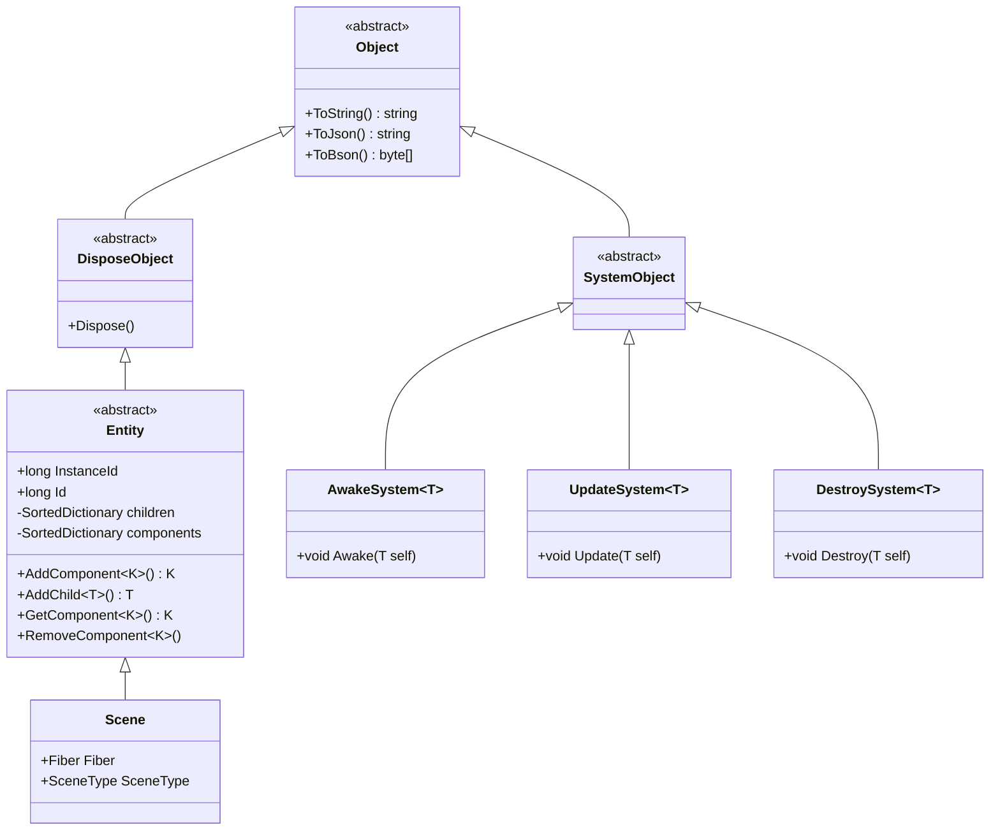

---
tags:
  - ET8/Entity
---

# 什么是 ECS？

ECS（Entity-Component-System）是一种架构模式，将 **数据** 和 **行为** 完全分离：

- **Entity**：只是一个 ID，是组件的容器
- **Component**：纯数据，不含逻辑方法
- **System**：纯逻辑，操作特定类型的 Component

> **对比 Unity 的 MonoBehaviour**：Unity 的 `MonoBehaviour` 既有数据（字段）又有逻辑（`Update`、`OnCollision` 等），是"面向对象"的设计。ET 的 ECS 将它们拆开，组件只存数据，System 只写逻辑。

# ET 的 ECS 核心类图



# Entity 的关键特征

ET 中的 Entity 有两个重要 ID：

| ID | 含义 | 生命周期 | 用途 |
|---|---|---|---|
| `Id` | 持久化标识 | 数据库级，跨进程不变 | MongoDB `_id`，唯一标识一个逻辑实体 |
| `InstanceId` | 运行时实例标识 | 进程内唯一，重启后改变 | Actor 消息寻址，标识内存中的具体对象 |

**Entity 既是实体也是组件** — ET 的 Component 本身也继承 Entity，这意味着组件也可以有自己的子组件。这种递归设计让数据结构非常灵活：

```
Scene (根实体)
├── PlayerComponent (组件)
│   └── Player (子实体)
│       ├── UnitComponent (组件)
│       ├── BagComponent (组件)
│       └── ...
├── TimerComponent (组件)
├── CoroutineLockComponent (组件)
└── ...
```

# System 的双重标记模式

ET 使用**双重标记**来关联 Entity 和 System：

**第一步**：Entity 类实现标记接口（声明"我需要哪些生命周期"）

```csharp
// 声明 PlayerComponent 需要 Awake(带参数) 和 Destroy 回调
[ComponentOf(typeof(Scene))]
public class PlayerComponent : Entity, IAwake, IDestroy
{
    public Dictionary<long, EntityRef<Player>> idPlayers;
}
```

**第二步**：对应的 System 类实现具体逻辑

```csharp
[EntitySystem]
public class PlayerComponentAwakeSystem : AwakeSystem<PlayerComponent>
{
    protected override void Awake(PlayerComponent self)
    {
        self.idPlayers = new Dictionary<long, EntityRef<Player>>();
    }
}

[EntitySystem]
public class PlayerComponentDestroySystem : DestroySystem<PlayerComponent>
{
    protected override void Destroy(PlayerComponent self)
    {
        // 清理逻辑
    }
}
```

**完整的 System 接口族：**

| System 类型 | 标记接口 | 触发时机 | 更新队列 |
|---|---|---|---|
| `AwakeSystem<T>` | `IAwake` / `IAwake<A>` / `IAwake<A,B>` / `IAwake<A,B,C>` | `AddComponent` 时 | 无 |
| `DestroySystem<T>` | `IDestroy` | `Dispose` 时 | 无 |
| `UpdateSystem<T>` | `IUpdate` | 每帧 | Update(0) |
| `LateUpdateSystem<T>` | `ILateUpdate` | 每帧（Update 之后） | LateUpdate(1) |
| `SerializeSystem<T>` | `ISerialize` | 序列化前 | 无 |
| `DeserializeSystem<T>` | `IDeserialize` | 反序列化后 | 无 |

> **为什么这样设计？** 数据和逻辑分离后，Hotfix.dll（包含 System）可以热重载，而 Model.dll（包含 Entity/Component 数据定义）保持不变。这就实现了**不停服热更新游戏逻辑**。

# 对象池机制

ET 的所有 Entity 和 MessageObject 都支持对象池：

```csharp
[DisableNew]  // 禁止 new，强制使用对象池
public abstract class MessageObject : ProtoObject, IMessage, IDisposable, IPool
{
    public bool IsFromPool { get; set; }
}
```

`Entity.Create<T>(scene, isFromPool)` 从池中获取，`Dispose()` 时自动回收。这大幅减少了 GC 压力，对于高频创建销毁的场景（如网络消息）尤为重要。

---
