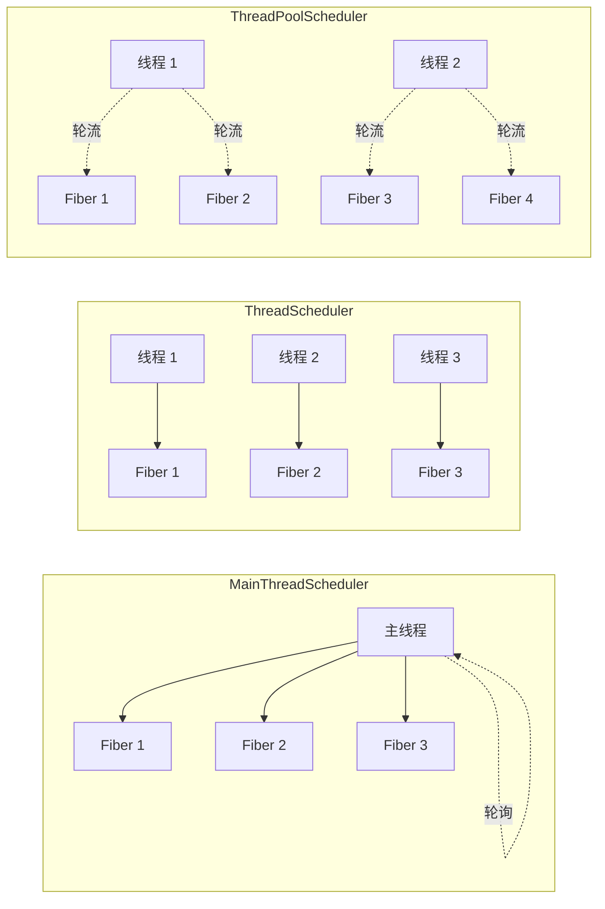

---
tags:
  - ET8/Fiber
---
# 什么是 Fiber？

**Fiber（纤程）** 是 ET 框架中最核心的并发模型。你可以把它理解为一个**轻量级的虚拟进程**：

| 操作系统进程 | ET Fiber |
|---|---|
| 有独立的内存空间 | 有独立的 Entity 树（Root Scene） |
| 有独立的线程/调度 | 有独立的 Update/LateUpdate 循环 |
| 通过 IPC/网络通信 | 通过 MessageQueue 通信 |
| 重量级，创建成本高 | 轻量级，内存中的一个对象 |

> **对前端的类比**：想象 Unity 的每个 Scene 可以独立运行 Update，互相之间只能通过消息通信 — 这就是 Fiber。

# Fiber 的核心结构

```csharp
public class Fiber : IDisposable
{
    [ThreadStatic] internal static Fiber Instance;  // 当前线程正在执行的 Fiber
    
    public int Id;                    // 纤程 ID
    public int Zone;                  // 所属区服
    public Scene Root;                // 根场景实体（实体树的根）
    public EntitySystem EntitySystem; // Update/LateUpdate 队列
    public Mailboxes Mailboxes;       // Actor 邮箱注册表
    public ThreadSynchronizationContext SynchronizationContext; // 异步回调调度
}
```

**`[ThreadStatic]` 的作用**：`Fiber.Instance` 是线程静态变量，保证在任意时刻，一个线程只会执行一个 Fiber 的逻辑。这从根本上避免了多线程并发问题 — 因为 Fiber 内部代码永远是单线程环境。

# 三种调度模式



| 调度器 | 机制 | 适用场景 |
|---|---|---|
| `MainThreadScheduler` | 所有 Fiber 在主线程轮询 | Unity Editor 调试（需要主线程访问 Unity API） |
| `ThreadScheduler` | 每个 Fiber 一个独立线程 | 开发调试（方便断点） |
| `ThreadPoolScheduler` | N 个线程共享调度所有 Fiber | **生产环境**（N = CPU 核心数，最高效） |

# SceneType — Fiber 的角色定义

每个 Fiber 创建时指定 `SceneType`，决定它的功能角色：

| SceneType | 角色 | 核心组件 |
|---|---|---|
| `Main` | 进程入口，初始化其他 Fiber | Timer, CoroutineLock, MailBox |
| `NetInner` | 进程间网络通信中转 | ProcessOuterSender, ProcessInnerSender |
| `Realm` | 登录/注册验证 | NetComponent(监听客户端), MessageSender |
| `Gate` | 客户端网关，消息路由 | NetComponent, PlayerComponent, LocationProxy |
| `Location` | Actor 位置注册服务 | LocationManagerComponent |
| `Map` | 游戏地图/场景逻辑 | UnitComponent, AOIManager, LocationProxy |
| `Match` | 匹配系统 | MatchComponent |
| `Router` | 网络路由/NAT 穿透 | RouterComponent |

> **游戏服务知识**：传统游戏服务器按"服务类型"部署多个进程（Login Server、Gate Server、Game Server...）。ET 用 Fiber 替代进程，一个物理进程可以包含多种类型的 Fiber，也可以拆分到不同机器 — 实现了**灵活的分布式部署**。

# 单进程 vs 分布式

ET 的一大优势是**开发时单进程，部署时分布式**：

```
开发模式（Localhost）:
┌──────── 单个进程 ────────┐
│ Main / NetInner / Realm  │
│ Gate / Location / Map    │  ← 所有 Fiber 在一个进程中
│ Match / Router ...       │
└──────────────────────────┘

生产模式（Release）:
┌── 进程1 ──┐  ┌── 进程2 ──┐  ┌── 进程3 ──┐
│ Main      │  │ Gate ×3   │  │ Map ×5    │
│ NetInner  │  │ NetInner  │  │ NetInner  │
│ Realm     │  │           │  │           │
│ Location  │  │           │  │           │
└───────────┘  └───────────┘  └───────────┘
               ↑↓ KCP/TCP 通信 ↑↓
```

通过修改 `StartSceneConfig` 配置，将不同的 SceneType 分配到不同 Process，即可实现从单机到分布式的平滑过渡。